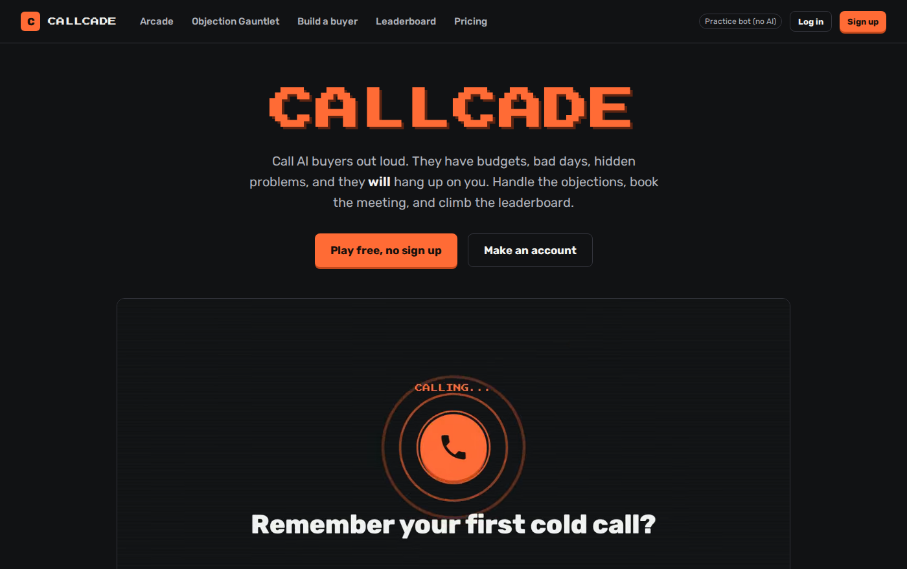
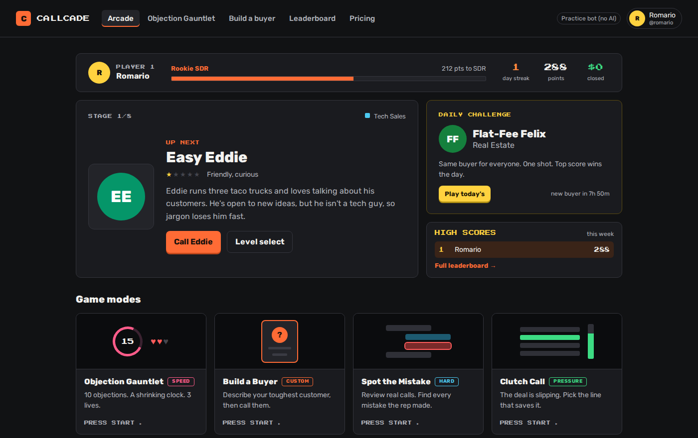
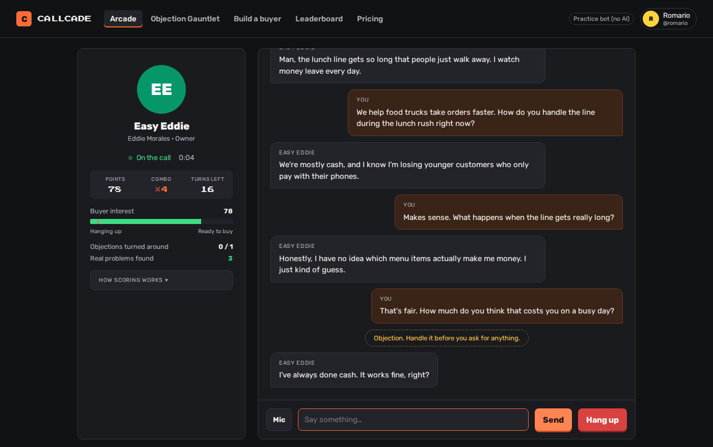
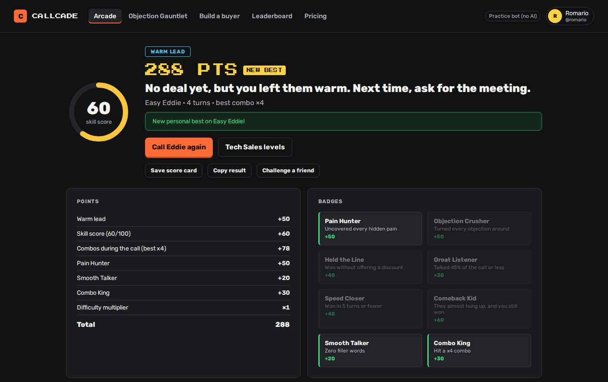
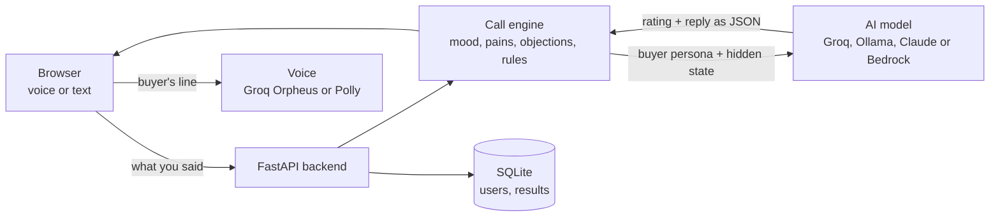

# Callcade

**A sales call arcade.** You get on the phone with AI buyers who have budgets, bad days, hidden problems, and objections ready, and you try to close them. Talk out loud like a real call, book the meeting or close the deal, and climb the leaderboard.



**Trailer:** [frontend/media/callcade-trailer-web.mp4](frontend/media/callcade-trailer-web.mp4).

## Why I built this

I've worked in sales for almost 3 years while studying computer science at CSULB. The way most new reps learn is by getting thrown on the phones and practicing on real customers, which means losing deals while you figure it out. I wanted a way to practice the hard parts (cold opens, objections, asking for the close) that's actually fun to replay, so I built it like an arcade game.

## Features

- **40 AI buyers across 5 industries, 8 levels each:** Tech Sales, Real Estate, Life Insurance, Car Sales, and Solar / door-to-door. Every buyer has a backstory (Doorbell-Cam Doug only talks to you through his Ring camera, Flat-Fee Felix already has a 1% broker lined up), and every industry ends with a boss (Victor, Investor Ivan, Dr. Diane, Fleet Nadia, Engineer Ed).
- **Buyers that act like real people.** Each one has a personality, a hidden mood, 3 hidden problems they only admit if you ask good questions, and 3 objections. They won't agree to anything until you've actually turned their objections around, so nobody "just buys."
- **Feels like a real call.** It rings, they pick up, and you talk out loud hands-free. It sends when you stop talking and you can press space to interrupt. Every buyer has their own voice and speaking style (Orpheus voices on Groq, or Amazon Polly), they sound annoyed or warm depending on how the call is going, and there's an optional phone-line filter. Solar calls happen at the front door instead.
- **Arcade scoring.** Book the meeting (+150), close on the spot (+300), land the upsell (+150), build combos with good lines in a row, earn badges, and get a difficulty multiplier up to ×3 on the bosses. Closed deals count toward your career "revenue closed."
- **Build your own buyer.** Type what you sell and describe your toughest real customer. The AI turns them into a buyer with hidden problems and objections, and you call them. You can share the link so a teammate can try them too. (Custom buyers are practice only, so nobody can farm points with an easy one.)
- **Calls start like real calls.** It rings three times, they pick up with just "Hello?", and they have no idea who you are until you tell them. Say nothing and they'll say "Hello?" again, then hang up.
- **Game modes:**
  - **Career mode:** beat each buyer to unlock the next.
  - **Objection Gauntlet:** 10 objections, a clock that shrinks from 30 to 15 seconds, and 3 lives. Weak answers cost a life, and the last one is a boss objection worth double.
  - **Spot the Mistake:** review 3 real-sounding calls (about 20 lines each, with real objections). Each hides 3 or 4 subtle mistakes among mostly good lines. Find them, then name what kind of mistake it was. Wrong taps cost lives, and missed mistakes cost points.
  - **Clutch Call:** a full call with 6 make-or-break moments. You get 4 lines that all sound reasonable and 15 seconds to pick the one a top rep would say. Bad picks drain deal health until they hang up.
  - **Daily Challenge:** the same buyer for everyone today, one scored try, with streaks.
  - **Challenge a friend:** send a link, they call the same buyer, higher score wins.
- **Call replay.** Listen back to the whole call, with the buyer's reaction to every line.
- **Keeps you coming back.** Daily streaks, a progress chart, a "weak spot" that points you at your worst skill, ranks, badges, and a shareable score card.
- **Free and Pro plans.** Guests can try Level 1 of any industry. A free account gets 3 levels of one industry they pick, 10 calls a day, and 3 gauntlet runs a day. Pro ($6.95/month) unlocks every buyer in every industry with no daily limits. Every plan still has to beat levels in order, and all of it is enforced on the server. (Checkout isn't hooked up yet, that's next.)
- **Accounts, profiles, and a leaderboard.** Sign up, unlock levels as you beat them, rank up from Rookie SDR to Sales Legend, collect badges, and compete all-time or weekly, per industry.
- **Post-call scorecard.** Skill score, talk-to-listen ratio, objections handled, a chart of the buyer's interest during the call, the lines where you won or lost them, what they were hiding, and coaching on what to say better.

| The arcade | The call | The scorecard |
| --- | --- | --- |
|  |  |  |

## How it works



- Every turn, the backend sends the model the buyer's personality, their rules, their current mood, and which problems and objections have already come up. The model replies in JSON: what the buyer says, how good the rep's last line was (great to terrible), and whether they revealed a problem, raised an objection, or want to end the call. The server turns that rating into the mood change, because models are much better at judging a line than at picking fair numbers.
- **The server has the final say.** It caps how fast the mood can go up (harder buyers warm up slower), enforces the hang-up line, and won't let the AI agree to a meeting or a sale unless the player has handled enough objections and found a real problem. So the AI can't just be nice and hand out wins.
- Scores are calculated on the server and saved to the database when a call ends, so the leaderboard can't be faked from the browser. Hidden problems and objections never get sent to the browser either.
- Passwords are hashed with PBKDF2 and a random salt, and logins use an httponly session cookie.
- The prompt also gets a "realism pack" (`backend/data/realism.json`) with how real buyers act on calls, real lines from that industry, and an example call, based on research into real sales calls.
- On Groq's free tier, each model has its own rate limit, so when one is maxed out the backend moves to the next model and remembers when the first one frees up.
- There's a demo mode with a rule-based buyer, so the whole app works without any AI connected (and the tests don't cost money).
- Accounts have email verification, password reset, change password, log out everywhere, and delete account. Sign-ups, logins, calls, and voice requests are rate limited. Daily limits reset at midnight in each player's own timezone.
- There's an admin page for managing users and removing bad scores, and errors get logged to a file.


## Project layout

```
backend/
  app.py          routes
  engine.py       the call engine (buyer state, rules, AI buyer prompt)
  scoring.py      scorecard, points, badges
  gauntlet.py     objection gauntlet
  mistakes.py     spot the mistake
  clutch.py       clutch call
  daily.py        daily challenge
  auth.py         sign up / log in
  account.py      verify email, reset password, settings
  custom.py       build your own buyer
  mailer.py       sends emails (or prints them if email isn't set up)
  ratelimit.py    stops spam
  db.py           database
  profiles.py     ranks, unlocks, profile stats
  plans.py        guest / free / pro rules and daily limits
  admin.py        command line helper to give a user Pro or admin while testing
  demo.py         rule-based buyer for demo mode
  llm.py          talks to the AI (Ollama, Groq, Claude API, or Bedrock)
  voice.py        buyer voices (Orpheus on Groq, or Polly)
  playtest.py     runs scripted calls against the real AI so I can check the buyers still feel right
  data/           the buyers for each industry, realism packs, objections, Spot the Mistake calls, Clutch Call scripts
frontend/
  index.html, css/, js/, fonts/
deploy/           server setup for AWS Lightsail (see docs/DEPLOY.md)
tests/
docs/
```

---

Made by Romario Salama · [LinkedIn](https://www.linkedin.com/in/romario-salama-8a5ba21a2/)
